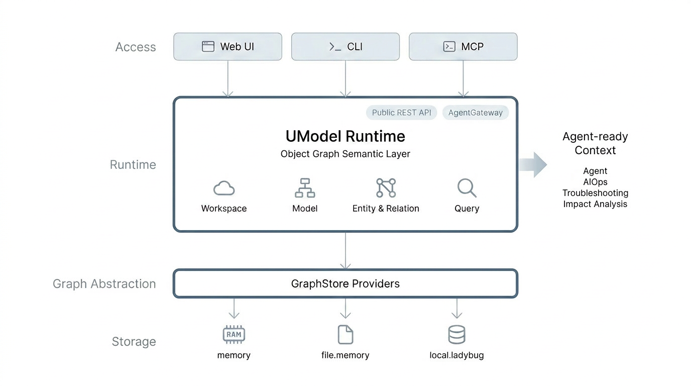

# UModel

[](https://github.com/alibaba/UnifiedModel/actions/workflows/ci.yml)


中文版本：[README_CN.md](README_CN.md)

UModel (Unified Model) is a vendor-neutral semantic runtime for enterprise AI, data governance, and operational intelligence. It turns fragmented schemas, entities, business objects, telemetry links, and topology relations into workspace-scoped graph context that humans, systems, and AI agents can understand and use through one local service.

With UModel, you can:

- Author and import model packs that define enterprise objects, operational objects, datasets, links, storage, and topology semantics.
- Write CMS 2.0 compatible runtime entities and relations.
- Query models, entities, and topology through one SPL surface: `.umodel`, `.entity`, and `.topo`.
- Explore the workspace through a local Web UI.
- Connect agent clients through AgentGateway and MCP.
- Use public REST, CLI, and SDK contracts without depending on server internals.

## Why UModel

- Accelerate enterprise AI at scale. A unified semantic standard helps AI models understand data meaning across platforms, departments, tools, and domains, improving the path to intelligent operations, customer service, analytics, prediction, and agent workflows.
- Reduce data governance cost. A shared language for multi-source enterprise data frees data teams from repetitive metric alignment, field translation, and context reconstruction, so more effort goes into extracting value from data.
- Preserve vendor neutrality and choice. UModel is independent of any single platform, data tool, observability stack, or AI vendor, helping organizations avoid semantic lock-in while building digital infrastructure.
- Build an enterprise semantic operating system. UModel moves beyond a passive data dictionary toward a live, programmable semantic runtime that AI agents can query, reason over, and use as shared context for future multi-agent collaboration.

## Project Scope

This repository includes the local UModel service, `umctl` CLI, MCP server, OpenAPI contract, React Web UI, generated SDK assets, example packs, Docker/Compose assets, and test suites.

The open-source core focuses on local operation, public contracts, semantic modeling, agent integration, and contributor-friendly extension points. Cloud-hosted control planes, multi-tenant authorization, Aliyun internal frontend packages, and domain-specific read APIs outside Query Service are outside the public core.

## Five-Minute Quick Start

Requirements:

- Go 1.22 or newer.
- Make.
- Node.js 22 or newer for the Web UI.
- pnpm 9 or newer is preferred; `corepack` or `npm exec` fallback is supported by the Makefile.

Check the local toolchain:

```bash
make check-env
```

Start the API and Web UI with a preloaded demo workspace:

```bash
make quickstart
```

`make quickstart` starts a local API, starts the Web UI, preloads the `demo` workspace with `GRAPHSTORE=memory`, and leaves no local demo data behind after the process stops.

Next steps:

- Open `http://localhost:5173`, select `demo`, and inspect the workspace through Explorer, Query, Data Store, and Agent views.
- Integrate an agent through AgentGateway or MCP. Start with `umctl agent discover demo`, then connect an MCP client through `umodel-mcp`.
- Query models, entities, and topology through CLI or REST using Query Service.

Detailed flows:

- [Quick Start](docs/en/getting-started/quickstart.md)
- [Web UI Guide](docs/en/guides/web-ui.md)
- [Query Service Guide](docs/en/guides/query-service.md)
- [MCP Reference](docs/en/reference/mcp.md)

Stop local services:

```bash
make stop-all
```

## Architecture



UModel runs as a local service around one workspace-scoped object graph:

- Model packs define the object vocabulary: EntitySets, datasets, links, storage, and relation semantics.
- EntityStore writes runtime entities and topology relations that instantiate the model.
- Query Service is the unified read surface for `.umodel`, `.entity`, and `.topo`.
- AgentGateway and MCP expose discovery, resources, query examples, and safe tools for agent clients.
- Web UI, CLI, REST, and SDK clients operate against the same public contracts.

Architecture details:

- [Architecture Overview](docs/en/architecture/overview.md)
- [Runtime Flow](docs/en/architecture/runtime-flow.md)
- [Query And Agent Architecture](docs/en/architecture/query-and-agent.md)

## Documentation

Start with the bilingual documentation index: [docs/README.md](docs/README.md).

| Area | Entry |
|---|---|
| Getting started | [Installation](docs/en/getting-started/installation.md), [Quick Start](docs/en/getting-started/quickstart.md) |
| Concepts | [Concepts Index](docs/en/concepts/index.md), [Object Graph Semantic Layer](docs/en/concepts/object-graph-semantic-layer.md) |
| Guides | [Model Authoring](docs/en/guides/model-authoring.md), [Entity And Relation Writes](docs/en/guides/entity-relation-writes.md), [Query Service](docs/en/guides/query-service.md), [Web UI](docs/en/guides/web-ui.md), [SDK And Client Guide](docs/en/guides/sdk-clients.md) |
| Architecture | [Architecture Overview](docs/en/architecture/overview.md), [Runtime Flow](docs/en/architecture/runtime-flow.md), [Query And Agent Architecture](docs/en/architecture/query-and-agent.md) |
| Reference | [CLI](docs/en/reference/cli.md), [MCP](docs/en/reference/mcp.md), [REST OpenAPI](api/openapi/openapi.yaml), [MCP Tool And Resource Schema](api/mcp/tools.schema.json) |
| Examples | [Multi-Domain Quickstart Example Pack](examples/quickstart-multidomain/README.md) |
| Deployment | [Docker And Compose](deployments/README.md) |

Chinese documentation: [docs/zh/README.md](docs/zh/README.md).

## Development

Install local dependencies:

```bash
make install-env
```

Build:

```bash
make build
```

Run focused checks:

```bash
make guard
make test-service
make verify
make example-validate
```

Run the local CI gate:

```bash
make ci
```

Generated Go and Python model SDKs live under `sdk/`. The Java SDK currently remains under `generated/java/`. The minimal Go service client lives under `sdk/go/service` and wraps public REST contracts.

## GraphStore Providers

Runtime GraphStore providers are selected with `--graphstore`.

| Provider | Typical use |
|---|---|
| `memory` | Ephemeral local tests and quickstart demos. Data is lost after process exit. |
| `file.memory` | JSON persistence under `--data`. Default for `make dev`, Docker, and Compose. |
| `local.ladybug` | Ladybug-backed environments. Requires `-tags ladybug` and a local Ladybug runtime. |

Provider details: [GraphStore Providers](docs/en/graphstore-providers.md).

## Governance And Support

- License: [Apache-2.0](LICENSE)
- Contributions: [CONTRIBUTING.md](CONTRIBUTING.md)
- Security policy: [SECURITY.md](SECURITY.md)
- Support channels: [SUPPORT.md](SUPPORT.md)
- Code of conduct: [CODE_OF_CONDUCT.md](CODE_OF_CONDUCT.md)
- Changelog: [CHANGELOG.md](CHANGELOG.md)
