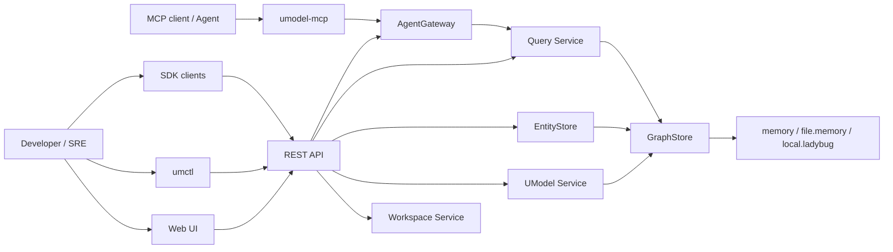

# Architecture Overview

中文：[架构总览](../../zh/architecture/overview.md)

UModel: local-first service with public API, CLI, Web UI, SDK, and MCP surfaces over one set of domain services.


## System View



## Layers

| Layer | Paths | Responsibility |
|---|---|---|
| Entry | `cmd/umodel-server`, `cmd/umctl`, `cmd/umodel-mcp` | Processes, flags, local runtime entry points. |
| API adapters | `api/openapi`, `api/mcp`, `internal/bootstrap` | REST routing, MCP schema exposure, server wiring. |
| Application services | `internal/workspace`, `internal/umodel`, `internal/entitystore`, `internal/query`, `internal/agentgateway` | Use-case logic for workspaces, model writes, runtime writes, reads, and agent access. |
| Contracts | `pkg/contract`, `pkg/model`, `pkg/errors` | Public service interfaces, shared types, stable error envelopes. |
| Storage abstraction | `internal/graphstore` | Provider-neutral persistence and graph access. |
| Providers | `memory`, `file.memory`, `local.ladybug` | Runtime storage implementations. |
| Clients | `web`, `sdk/go`, `sdk/python`, `generated/java` | User-facing and integration-facing clients. |

## Public Contract Rule

Public contract:

- REST OpenAPI: [api/openapi/openapi.yaml](../../../api/openapi/openapi.yaml)
- MCP schema: [api/mcp/tools.schema.json](../../../api/mcp/tools.schema.json)
- Shared model types: [pkg/model/types.go](../../../pkg/model/types.go)
- Service contracts: [pkg/contract/contracts.go](../../../pkg/contract/contracts.go)
- CLI behavior: [docs/en/reference/cli.md](../reference/cli.md)

Implementation packages can change more freely than these surfaces. When a public contract changes, update docs, tests, examples, SDK expectations, and the Web UI in the same pull request.

## Core Design Decisions

- Workspace-scoped operations keep local data isolated.
- Query Service is the only public read path for model, entity, and topology data.
- EntityStore writes runtime objects and relations; it does not expose public read APIs.
- UModel Service writes and validates model definitions.
- AgentGateway uses Query Service for runtime rows and keeps resources metadata-oriented.
- GraphStore providers hide persistence details from application services.

## Architecture Guard

The repository includes an architecture guard at [tools/guards/architecture_guard.py](../../../tools/guards/architecture_guard.py). Run it with:

```bash
make guard
```

The guard protects key boundaries such as no public domain read APIs outside Query Service and no direct provider imports from business modules.
