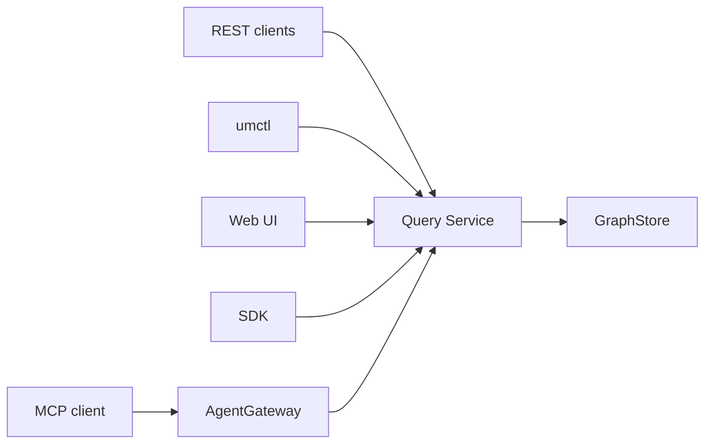

# Query And Agent Architecture

中文：[Query 与 Agent 架构](../../zh/architecture/query-and-agent.md)

Query Service owns runtime reads. AgentGateway exposes those reads to tools, resources, and MCP clients without inventing a second query model.


## Read Boundary



Runtime read sources:

- `.umodel`
- `.entity`
- `.topo`

Single query boundary keeps the public contract stable and gives every client the same explain output.

## AgentGateway Responsibilities

AgentGateway provides:

- Tool discovery.
- Tool input and output schemas.
- Metadata resources.
- Query examples.
- Suggested next actions.

It does not own a separate data access layer. Runtime rows should come from Query Service tools.

## MCP Server

`umodel-mcp` wires local GraphStore configuration and exposes AgentGateway-compatible tools/resources to MCP clients.

Supported transports:

- Stdio for local MCP clients.
- Streamable HTTP at `/mcp`.
- Backward-compatible HTTP+SSE at `/sse` and `/messages`.

Local stdio command:

```bash
go run ./cmd/umodel-mcp --data data --graphstore file.memory
```

HTTP command:

```bash
go run ./cmd/umodel-mcp --transport http --addr 127.0.0.1:8090 --data data --graphstore file.memory
```

The MCP JSON-RPC envelope stays JSON. Tool and resource content text uses `text/toon`; clients that need JSON can consume `structuredContent` on tool results.

Examples: [examples/mcp](../../../examples/mcp/README.md).

## REST Agent Entry Points

```http
GET  /api/v1/agent/{workspace}/discover
POST /api/v1/agent/{workspace}/tools:execute
POST /api/v1/agent/{workspace}/resources:read
```

CLI examples:

```bash
go run ./cmd/umctl --addr http://localhost:8080 agent discover demo
go run ./cmd/umctl --addr http://localhost:8080 agent tool demo query_spl_examples '{}'
go run ./cmd/umctl --addr http://localhost:8080 agent tool demo query_spl_explain '{"query":".umodel | limit 5"}'
```

## Safety Model

- Resources are read-only and metadata-oriented by default.
- Query tools can read rows through Query Service.
- Write tools require explicit write enablement.
- Agent-facing examples should use bounded queries with `limit`.
- Tool descriptions should make side effects clear.

## Testing Expectations

When changing query or agent behavior, update:

- Query parser, planner, and service tests under `internal/query`.
- AgentGateway tests under `internal/agentgateway`.
- MCP schema under `api/mcp/tools.schema.json` when tool contracts change.
- CLI reference and MCP reference docs.
- Web UI examples when the visible query experience changes.
