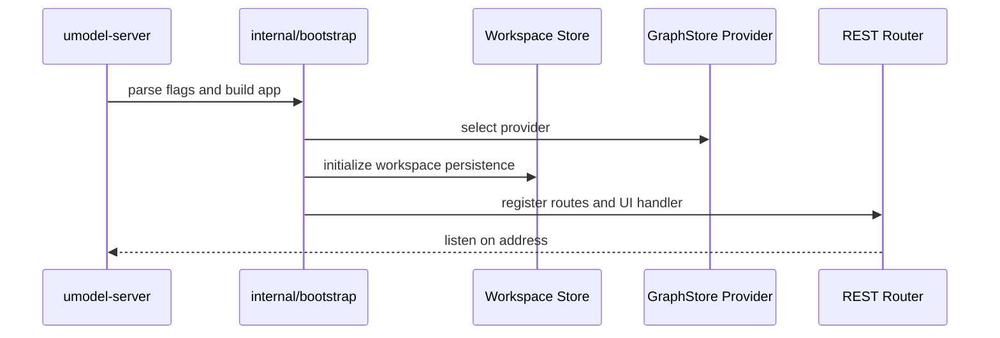
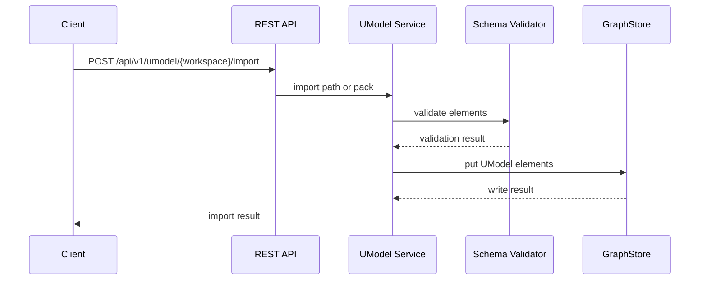
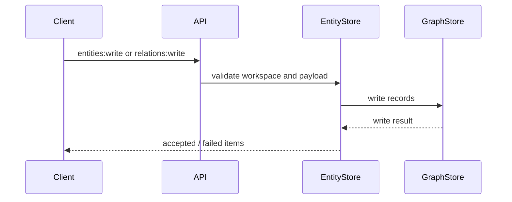
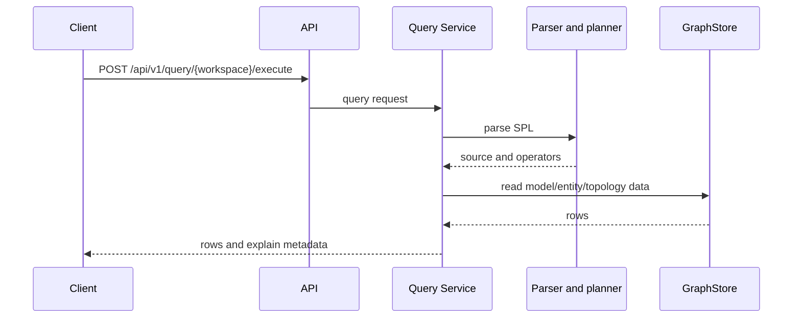

# Runtime Flow

中文：[运行时流程](../../zh/architecture/runtime-flow.md)

Runtime paths for startup, model import, entity/relation writes, Query Service, AgentGateway, and MCP.


## Startup



Runtime flags:

| Flag | Meaning |
|---|---|
| `--addr` | API listen address, for example `:8080`. |
| `--data` | Local data root. |
| `--graphstore` | Provider name: `memory`, `file.memory`, or `local.ladybug`. |

## Model Import



The bundled multi-domain quickstart sample uses the same path, wrapped by:

```http
POST /api/v1/samples/{workspace}/multi-domain-quickstart:import
```

## Entity And Relation Writes



EntityStore is write-oriented. Runtime reads go through Query Service.

## Query Execution



## AgentGateway And MCP

AgentGateway exposes a safe agent-facing layer:

- Discovery lists tools, resources, and next actions.
- Query tools execute or explain SPL.
- Resources expose metadata and templates.
- Write tools stay disabled unless explicitly enabled.

`umodel-mcp` connects MCP clients to the same AgentGateway semantics used by REST.

## Local Persistence

With `file.memory`, GraphStore data is saved under:

```text
data/graphstore/file-memory/workspaces/<workspace>/
├── umodels.json
├── entities.json
└── relations.json
```

Workspace metadata is saved separately at:

```text
data/workspaces.json
```

Storage details: [Storage And GraphStore Providers](../concepts/storage-and-graphstore.md).
