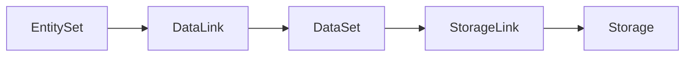

# Datasets

中文：[DataSet](../../zh/concepts/datasets.md)

Datasets describe telemetry or knowledge collections that can be attached to entities. They do not store runtime rows themselves; they describe the shape and query semantics of data held in storage systems.


## Dataset Kinds

| Kind | Use |
|---|---|
| `metric_set` | Time-series or metric-style signals. |
| `log_set` | Log records and structured log fields. |
| `trace_set` | Trace/span data. |
| `event_set` | Event streams or change records. |
| `profile_set` | Profiling data. |
| `runbook_set` | Operational playbooks or remediation knowledge. |

## MetricSet

A MetricSet defines labels and metrics. For example, a service metric set can describe request metrics keyed by a stable service identifier.

```yaml
kind: metric_set
metadata:
  name: "devops.metric.devops.service"
  domain: devops
spec:
  labels:
    keys:
      - name: service_id
        type: string
  metrics:
    - name: request_count
      aggregator: sum
```

## LogSet And TraceSet

LogSet and TraceSet definitions play the same modeling role for logs and traces:

- They name the dataset.
- They describe important fields.
- They can be linked to EntitySets.
- They can be routed to storage by StorageLink.

## Dataset Binding

Datasets become useful when both links exist:



## Design Rules

- Keep dataset names stable and semantic.
- Put entity-to-telemetry matching rules in `data_link.fields_mapping`.
- Put physical storage information in storage definitions and StorageLinks.
- Use one dataset when the labels, metrics, and storage behavior belong together.
- Split datasets when they have different storage, refresh, or ownership behavior.

## Query Examples

List metric sets:

```bash
go run ./cmd/umctl --addr http://localhost:8080 query run demo ".umodel with(kind='metric_set') | sort name | limit 20"
```

Inspect datasets and storage links in the Web UI Explorer after importing a model pack that includes telemetry definitions.
