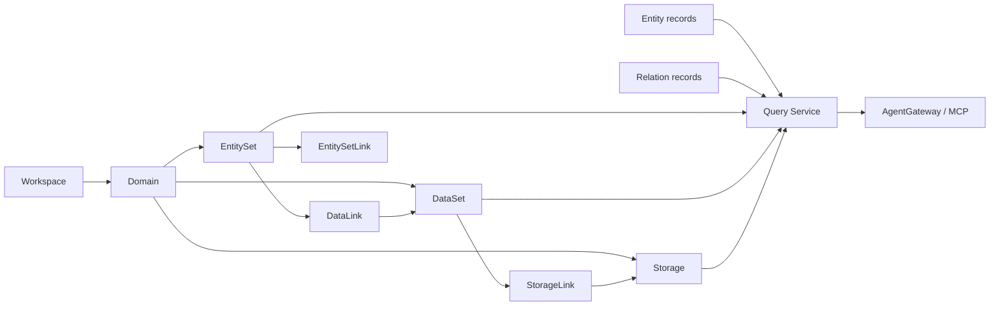

# Concepts

中文：[概念索引](../../zh/concepts/index.md)

Concept map for contributors working with schemas, services, CLI, Web UI, MCP, and example packs.

## Recommended Reading Order

1. [Object Graph Semantic Layer](object-graph-semantic-layer.md)
2. [Workspaces And Domains](workspaces-and-domains.md)
3. [Model Elements](model-elements.md)
4. [Entity Sets](entity-sets.md)
5. [Datasets](datasets.md)
6. [Links And Field Mappings](links-and-field-mappings.md)
7. [Storage And GraphStore Providers](storage-and-graphstore.md)
8. [Entities And Relations](entities-and-relations.md)
9. [Query Surfaces](query-surfaces.md)

## Concept Map

## Concept Groups

| Group | Concepts | Role |
|---|---|---|
| Scope | Workspace, domain | Keeps model and runtime data isolated and nameable. |
| Model definitions | EntitySet, DataSet, Storage, Link | Describes the semantic contract before runtime data is written. |
| Runtime graph | Entity, relation | Provides the actual object graph that Query Service can read. |
| Read surface | `.umodel`, `.entity`, `.topo` | Gives REST, CLI, Web UI, SDK, and MCP one aligned query path. |
| Storage abstraction | GraphStore provider | Lets the same public service run against memory, file-backed, or Ladybug-backed stores. |

## Source References

- Schema definitions: [schemas/](../../../schemas)
- Public model types: [pkg/model/types.go](../../../pkg/model/types.go)
- Public service contracts: [pkg/contract/contracts.go](../../../pkg/contract/contracts.go)
- Multi-domain quickstart example pack: [examples/quickstart-multidomain](../../../examples/quickstart-multidomain/README.md)
