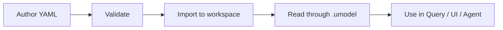

# Model Elements

中文：[Model Elements](../../zh/concepts/model-elements.md)

UModel elements are versioned model definitions. They define the object graph before runtime entity and relation records are written.


## Element Envelope

Authoring files use a common YAML shape:

```yaml
kind: entity_set
schema:
  url: "umodel.aliyun.com"
  version: "v0.1.0"
metadata:
  name: "devops.service"
  domain: devops
spec:
  fields: []
```

Important fields:

| Field | Meaning |
|---|---|
| `kind` | Model kind, such as `entity_set`, `metric_set`, `data_link`, or `sls_metricstore`. |
| `schema.version` | Schema version used to validate this element. |
| `metadata.name` | Stable name inside the domain. |
| `metadata.domain` | Semantic namespace. |
| `metadata.display_name` | Human-facing bilingual name when available. |
| `spec` | Kind-specific content. |

## Core Kinds

| Category | Kinds |
|---|---|
| Entities | `entity_set` |
| Datasets | `metric_set`, `log_set`, `trace_set`, `event_set`, `profile_set`, `runbook_set` |
| Links | `data_link`, `entity_set_link`, `storage_link`, `runbook_link`, `entity_source_link`, `explorer_link` |
| Storage | `sls_logstore`, `sls_metricstore`, `sls_entitystore`, `aliyun_prometheus`, `external_storage` |

## Lifecycle



## Import Paths

Bundled sample import:

```bash
curl -X POST http://localhost:8080/api/v1/samples/demo/multi-domain-quickstart:import \
  -H 'Content-Type: application/json' \
  -d '{}'
```

Import your own model pack with the CLI:

```bash
go run ./cmd/umctl --addr http://localhost:8080 umodel import demo examples/quickstart-multidomain
```

## Validation And References

Validation checks the element shape before writing it to GraphStore. Schema source files live under [schemas/](../../../schemas), and generated reference HTML lives under [docs/html](../../html/index.html), [docs/html_en](../../html_en/index.html), and [docs/html_cn](../../html_cn/index.html).

## Related Concepts

- [Entity Sets](entity-sets.md)
- [Datasets](datasets.md)
- [Links And Field Mappings](links-and-field-mappings.md)
- [Storage And GraphStore Providers](storage-and-graphstore.md)
