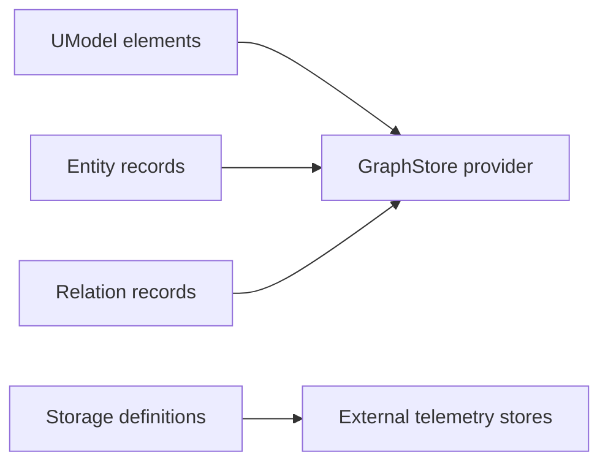

# Storage And GraphStore Providers

中文：[Storage 与 GraphStore](../../zh/concepts/storage-and-graphstore.md)

UModel separates modeled storage from runtime GraphStore providers.


## Storage Definitions

Storage definitions are UModel elements. They describe where telemetry datasets live.

Supported storage kinds include:

| Kind | Typical target |
|---|---|
| `sls_logstore` | SLS logs, traces, events. |
| `sls_metricstore` | SLS metric stores. |
| `sls_entitystore` | SLS entity data. |
| `aliyun_prometheus` | Prometheus-compatible metric data. |
| `external_storage` | Storage outside built-in providers. |

Example:

```yaml
kind: sls_metricstore
metadata:
  name: "devops.metric_set.core.storage"
  domain: devops
spec:
  region: "cn-hangzhou"
  project: "proj-devops-demo"
  store: "metricstore-devops-metrics"
```

## GraphStore Providers

GraphStore providers are runtime implementations behind the local UModel service.

| Provider | Role |
|---|---|
| `memory` | Fast in-memory provider for tests and disposable local work. |
| `file.memory` | JSON-backed local provider; default for `make dev`, Docker, and Compose. |
| `local.ladybug` | Ladybug-backed provider when built with `-tags ladybug`. |

Start the service with a specific provider:

```bash
go run ./cmd/umodel-server --addr :8080 --data data --graphstore file.memory
```

## Separation Rule

Storage definitions define domain telemetry organization. GraphStore providers persist and query UModel's own model graph, entity records, and relation records.



## Operational Notes

- Use `file.memory` for local documentation, demos, and contribution workflows.
- Use `memory` for short tests when persistence is not needed.
- Use `local.ladybug` only when the local Ladybug runtime and build tags are available.
- Do not run multiple writers against the same `file.memory` directory.

Provider layout and smoke tests: [GraphStore Providers](../graphstore-providers.md).
