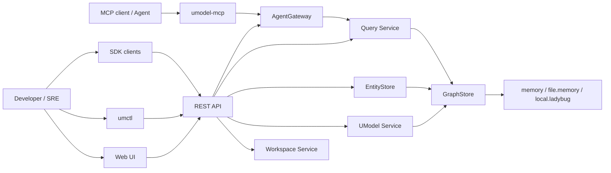

# 架构总览

English: [Architecture Overview](../../en/architecture/overview.md)

UModel 是 local-first 服务：REST API、CLI、Web UI、SDK 和 MCP 共享同一组领域服务和公共契约。


## 系统视图



## 分层

| 层 | 路径 | 职责 |
|---|---|---|
| Entry | `cmd/umodel-server`, `cmd/umctl`, `cmd/umodel-mcp` | 进程、flags、本地运行入口。 |
| API adapters | `api/openapi`, `api/mcp`, `internal/bootstrap` | REST routing、MCP schema、server wiring。 |
| Application services | `internal/workspace`, `internal/umodel`, `internal/entitystore`, `internal/query`, `internal/agentgateway` | Workspace、模型写入、运行时写入、读取和 Agent 接入。 |
| Contracts | `pkg/contract`, `pkg/model`, `pkg/errors` | 公共接口、共享类型、稳定错误 envelope。 |
| Storage abstraction | `internal/graphstore` | Provider-neutral 的持久化和图访问。 |
| Providers | `memory`, `file.memory`, `local.ladybug` | 运行时存储实现。 |
| Clients | `web`, `sdk/go`, `sdk/python`, `generated/java` | 用户和集成客户端。 |

## 公共契约

公共契约包括：

- REST OpenAPI：[api/openapi/openapi.yaml](../../../api/openapi/openapi.yaml)
- MCP schema：[api/mcp/tools.schema.json](../../../api/mcp/tools.schema.json)
- 共享模型类型：[pkg/model/types.go](../../../pkg/model/types.go)
- 服务契约：[pkg/contract/contracts.go](../../../pkg/contract/contracts.go)
- CLI 行为：[CLI 参考](../reference/cli.md)

公共契约变更必须在同一个 PR 中更新 docs、tests、examples、SDK 期望和 Web UI。

## 核心设计决策

- 所有操作都以 workspace 为边界。
- Query Service 是模型、实体和拓扑数据的唯一公共读取路径。
- EntityStore 负责写入运行时对象和关系，不提供公共读取 API。
- UModel Service 负责模型定义写入和校验。
- AgentGateway 通过 Query Service 获取运行时 rows，resources 保持 metadata-oriented。
- GraphStore provider 隔离持久化细节。

## Architecture Guard

Architecture guard：[tools/guards/architecture_guard.py](../../../tools/guards/architecture_guard.py)。运行方式：

```bash
make guard
```

Guard 保护关键边界，例如不在 Query Service 外新增公共领域读取 API，业务模块不直接导入 provider 实现包。
