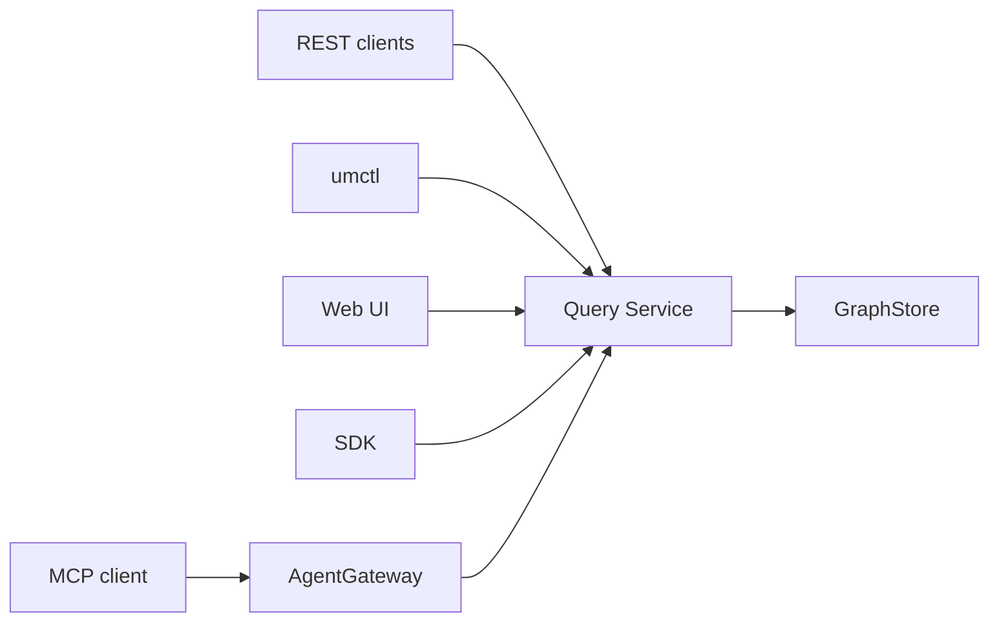

# Query 与 Agent 架构

English: [Query And Agent Architecture](../../en/architecture/query-and-agent.md)

Query Service 拥有运行时读取。AgentGateway 将这些读取能力包装为 Agent 可发现、可审计、可控的 tools 和 resources。


## 读取边界



运行时读取统一进入 Query Service：

- `.umodel`
- `.entity`
- `.topo`

单一查询边界保持 public contract 稳定，并让所有客户端获得同一套 explain 输出。

## AgentGateway 职责

AgentGateway 提供：

- Tool discovery。
- Tool input/output schema。
- Metadata resources。
- Query examples。
- Suggested next actions。

它不维护独立数据访问层。运行时 rows 由 Query Service tools 返回。

## MCP Server

`umodel-mcp` 连接本地 GraphStore 配置，并向 MCP clients 暴露与 AgentGateway 兼容的 tools/resources。

支持的 transport：

- Stdio，用于本地 MCP client。
- Streamable HTTP，入口为 `/mcp`。
- 向后兼容的 HTTP+SSE，入口为 `/sse` 和 `/messages`。

本地 stdio 命令：

```bash
go run ./cmd/umodel-mcp --data data --graphstore file.memory
```

HTTP 命令：

```bash
go run ./cmd/umodel-mcp --transport http --addr 127.0.0.1:8090 --data data --graphstore file.memory
```

MCP JSON-RPC 外壳保持 JSON。Tool 和 Resource 的 content text 使用 `text/toon`；需要 JSON 的 client 可以读取 tool result 上的 `structuredContent`。

示例：[examples/mcp](../../../examples/mcp/README.zh-CN.md)。

## REST Agent 入口

```http
GET  /api/v1/agent/{workspace}/discover
POST /api/v1/agent/{workspace}/tools:execute
POST /api/v1/agent/{workspace}/resources:read
```

CLI 示例：

```bash
go run ./cmd/umctl --addr http://localhost:8080 agent discover demo
go run ./cmd/umctl --addr http://localhost:8080 agent tool demo query_spl_examples '{}'
go run ./cmd/umctl --addr http://localhost:8080 agent tool demo query_spl_explain '{"query":".umodel | limit 5"}'
```

## 安全模型

- Resources 默认只读，且以元数据为主。
- Query tools 通过 Query Service 读取 rows。
- 写工具需要显式启用。
- Agent-facing 示例应使用带 `limit` 的有界查询。
- Tool 描述必须明确 side effect。

## 测试预期

修改 query 或 agent 行为时，应更新：

- `internal/query` 下的 Query parser、planner 和 service tests。
- `internal/agentgateway` 下的 AgentGateway tests。
- Tool contract 变化时更新 `api/mcp/tools.schema.json` 下的 MCP schema。
- CLI reference 和 MCP reference docs。
- 可见 query experience 变化时更新 Web UI examples。
