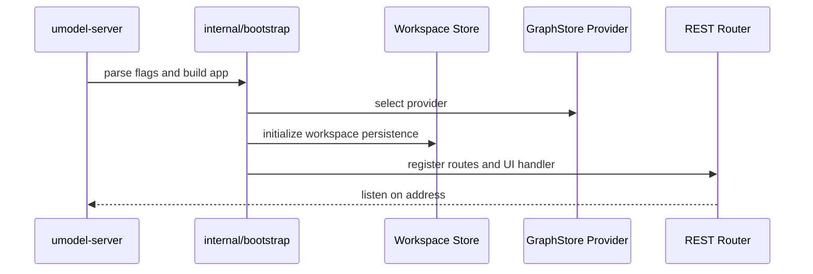
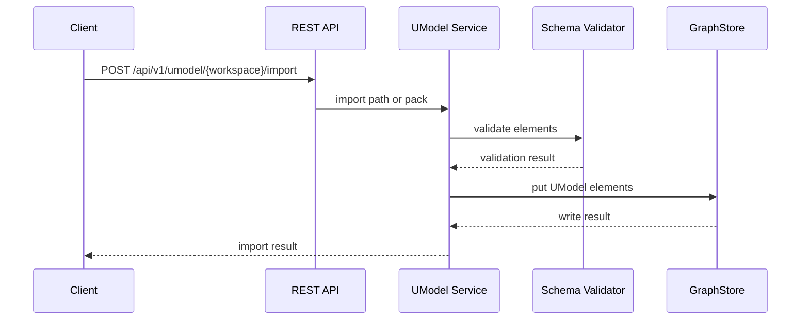
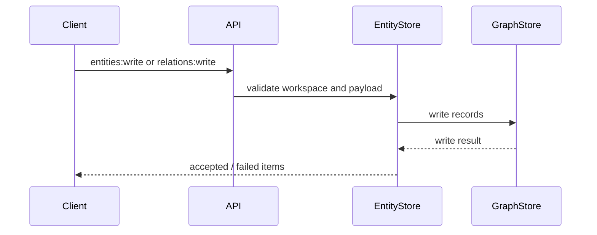
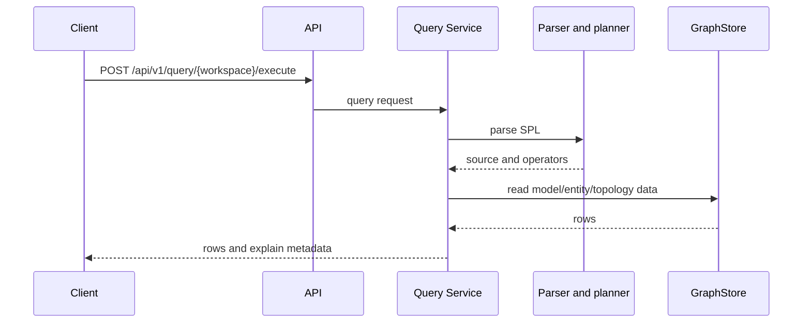

# 运行时流程

English: [Runtime Flow](../../en/architecture/runtime-flow.md)

本地服务启动、模型导入、实体关系写入、Query Service、AgentGateway 和 MCP 的运行路径。


## 启动



运行参数：

| Flag | 含义 |
|---|---|
| `--addr` | API 监听地址，例如 `:8080`。 |
| `--data` | 本地数据目录。 |
| `--graphstore` | Provider 名称：`memory`、`file.memory`、`local.ladybug`。 |

## 模型导入



内置多域 quickstart 样例通过以下 endpoint 包装同一路径：

```http
POST /api/v1/samples/{workspace}/multi-domain-quickstart:import
```

## Entity 与 Relation 写入



EntityStore 是写入面；运行时读取统一通过 Query Service。

## 查询执行



## AgentGateway 与 MCP

AgentGateway 提供安全的 Agent-facing 层：

- Discovery 列出 tools、resources、next actions。
- Query tools 执行或解释 SPL。
- Resources 暴露元数据和模板。
- 写工具默认关闭，需显式启用。

`umodel-mcp` 将 MCP clients 接入同一套 AgentGateway 语义。

## 本地持久化

使用 `file.memory` 时：

```text
data/graphstore/file-memory/workspaces/<workspace>/
├── umodels.json
├── entities.json
└── relations.json
```

Workspace 元数据：

```text
data/workspaces.json
```

存储细节：[Storage 与 GraphStore](../concepts/storage-and-graphstore.md)。
