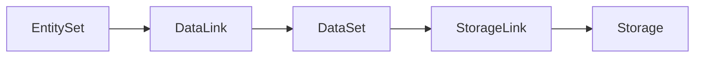

# DataSet

English: [Datasets](../../en/concepts/datasets.md)

DataSet 定义附着到实体上的遥测或知识集合。它不直接保存运行时行数据，而是定义数据形状和查询语义。


## DataSet Kinds

| Kind | 用途 |
|---|---|
| `metric_set` | 时序指标或 metric-style 信号。 |
| `log_set` | 日志记录和结构化日志字段。 |
| `trace_set` | Trace/span 数据。 |
| `event_set` | 事件流或变更记录。 |
| `profile_set` | 性能剖析数据。 |
| `runbook_set` | 运维手册或处置知识。 |

## MetricSet

MetricSet 定义 labels 和 metrics。例如，服务指标集可以用稳定的服务标识关联请求类指标。

```yaml
kind: metric_set
metadata:
  name: "devops.metric.devops.service"
  domain: devops
spec:
  labels:
    keys:
      - name: service_id
        type: string
  metrics:
    - name: request_count
      aggregator: sum
```

## LogSet And TraceSet

LogSet 和 TraceSet 定义在日志与链路数据上承担相同的建模角色：

- 为 dataset 命名。
- 描述关键字段。
- 通过 DataLink 连接到 EntitySet。
- 通过 StorageLink 路由到存储。

## 绑定路径

DataSet 要真正可用，通常需要两类链接：



## 设计规则

- Dataset 名称要稳定且语义化。
- 实体到遥测的匹配规则放在 `data_link.fields_mapping`。
- 物理存储信息放在 Storage 和 StorageLink。
- labels、metrics、storage 行为一致时使用同一个 Dataset。
- 存储、刷新或责任边界不同的集合应拆成不同 Dataset。

## 查询示例

查询 metric sets：

```bash
go run ./cmd/umctl --addr http://localhost:8080 query run demo ".umodel with(kind='metric_set') | sort name | limit 20"
```

导入包含遥测定义的模型包后，Web UI Explorer 会展示对应 datasets 和 storage links。
