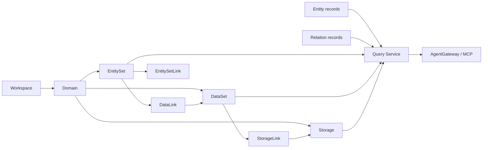

# 概念索引

English: [Concepts](../../en/concepts/index.md)

面向 schema、service、CLI、Web UI、MCP 和样例包贡献者的概念地图。

## 推荐阅读顺序

1. [对象图语义层](object-graph-semantic-layer.md)
2. [Workspace 与 Domain](workspaces-and-domains.md)
3. [Model Elements](model-elements.md)
4. [EntitySet](entity-sets.md)
5. [DataSet](datasets.md)
6. [Link 与字段映射](links-and-field-mappings.md)
7. [Storage 与 GraphStore](storage-and-graphstore.md)
8. [Entity 与 Relation](entities-and-relations.md)
9. [查询入口](query-surfaces.md)

## 概念地图

## 概念分组

| 分组 | 概念 | 角色 |
|---|---|---|
| 范围 | Workspace、domain | 隔离模型和运行时数据。 |
| 模型定义 | EntitySet、DataSet、Storage、Link | 在写入运行时数据前定义语义契约。 |
| 运行时图 | Entity、Relation | 提供 Query Service 可读取的对象图实例。 |
| 读取入口 | `.umodel`、`.entity`、`.topo` | 让 REST、CLI、Web UI、SDK、MCP 使用同一套查询路径。 |
| 存储抽象 | GraphStore provider | 让同一服务可运行在内存、文件或 Ladybug-backed provider 上。 |

## 源码入口

- Schema 定义：[schemas/](../../../schemas)
- 公共模型类型：[pkg/model/types.go](../../../pkg/model/types.go)
- 公共服务契约：[pkg/contract/contracts.go](../../../pkg/contract/contracts.go)
- 多域 Quickstart 样例包：[examples/quickstart-multidomain](../../../examples/quickstart-multidomain/README.zh-CN.md)
