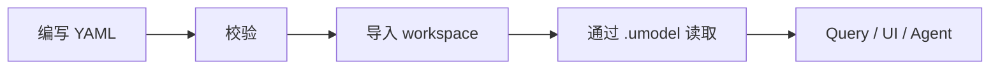

# Model Elements

English: [Model Elements](../../en/concepts/model-elements.md)

UModel element 是版本化的模型定义。它描述对象图的结构，而不是运行时实体数据本身。


## 通用结构

UModel YAML 通常采用以下结构：

```yaml
kind: entity_set
schema:
  url: "umodel.aliyun.com"
  version: "v0.1.0"
metadata:
  name: "devops.service"
  domain: devops
spec:
  fields: []
```

关键字段：

| 字段 | 含义 |
|---|---|
| `kind` | 模型类型，例如 `entity_set`、`metric_set`、`data_link`、`sls_metricstore`。 |
| `schema.version` | Schema 校验版本。 |
| `metadata.name` | domain 内稳定名称。 |
| `metadata.domain` | 语义命名空间。 |
| `metadata.display_name` | 面向人的双语名称。 |
| `spec` | kind-specific 内容。 |

## 核心 Kind

| 分类 | Kinds |
|---|---|
| 实体 | `entity_set` |
| 数据集 | `metric_set`, `log_set`, `trace_set`, `event_set`, `profile_set`, `runbook_set` |
| 链接 | `data_link`, `entity_set_link`, `storage_link`, `runbook_link`, `entity_source_link`, `explorer_link` |
| 存储 | `sls_logstore`, `sls_metricstore`, `sls_entitystore`, `aliyun_prometheus`, `external_storage` |

## 生命周期



## 导入路径

导入内置多域 quickstart 样例：

```bash
curl -X POST http://localhost:8080/api/v1/samples/demo/multi-domain-quickstart:import \
  -H 'Content-Type: application/json' \
  -d '{}'
```

导入自定义模型包：

```bash
go run ./cmd/umctl --addr http://localhost:8080 umodel import demo examples/quickstart-multidomain
```

## 校验与引用

Validation 在写入 GraphStore 之前检查 element shape。Schema 源文件位于 [schemas/](../../../schemas)，生成参考 HTML 位于 [docs/html](../../html/index.html)、[docs/html_en](../../html_en/index.html) 和 [docs/html_cn](../../html_cn/index.html)。

## 相关概念

- [EntitySet](entity-sets.md)
- [DataSet](datasets.md)
- [Link 与字段映射](links-and-field-mappings.md)
- [Storage 与 GraphStore](storage-and-graphstore.md)
