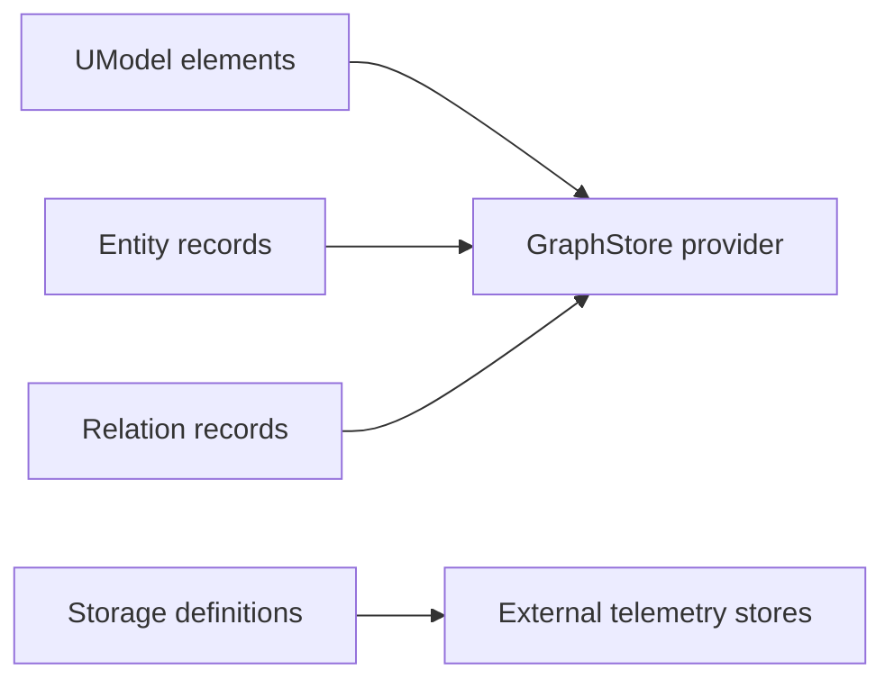

# Storage 与 GraphStore

English: [Storage And GraphStore Providers](../../en/concepts/storage-and-graphstore.md)

UModel 区分模型中的 Storage 定义和服务运行时的 GraphStore provider。


## Storage 定义

Storage 是 UModel element，描述遥测数据存放在哪里。

| Kind | 典型目标 |
|---|---|
| `sls_logstore` | SLS 日志、链路、事件。 |
| `sls_metricstore` | SLS MetricStore。 |
| `sls_entitystore` | SLS 实体数据。 |
| `aliyun_prometheus` | Prometheus-compatible 指标数据。 |
| `external_storage` | 内置 provider 之外的存储。 |

示例：

```yaml
kind: sls_metricstore
metadata:
  name: "devops.metric_set.core.storage"
  domain: devops
spec:
  region: "cn-hangzhou"
  project: "proj-devops-demo"
  store: "metricstore-devops-metrics"
```

## GraphStore Providers

GraphStore provider 是本地 UModel 服务背后的运行时实现。

| Provider | 角色 |
|---|---|
| `memory` | 面向测试和一次性本地工作的内存 provider。 |
| `file.memory` | JSON-backed 本地 provider，是 `make dev`、Docker、Compose 的默认选择。 |
| `local.ladybug` | 使用 `-tags ladybug` 构建时的 Ladybug-backed provider。 |

启动示例：

```bash
go run ./cmd/umodel-server --addr :8080 --data data --graphstore file.memory
```

## 分离规则

Storage 定义领域遥测数据组织方式；GraphStore provider 保存并查询 UModel 自身的模型图、实体记录和关系记录。



## 运维规则

- 本地文档、demo 和贡献工作流使用 `file.memory`。
- 不需要持久化的短测试使用 `memory`。
- 只有在本地 Ladybug runtime 和 build tags 可用时才使用 `local.ladybug`。
- 不要让多个 writer 同时写入同一个 `file.memory` 目录。

目录布局和 smoke tests 见 [GraphStore Providers](../graphstore-providers.md)。
